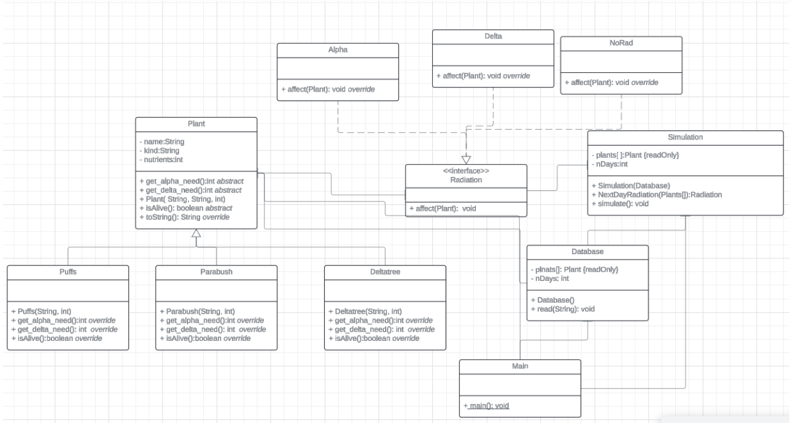
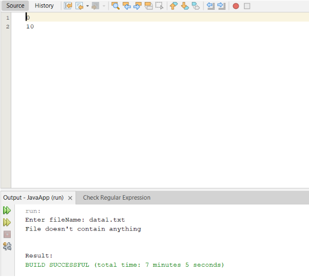
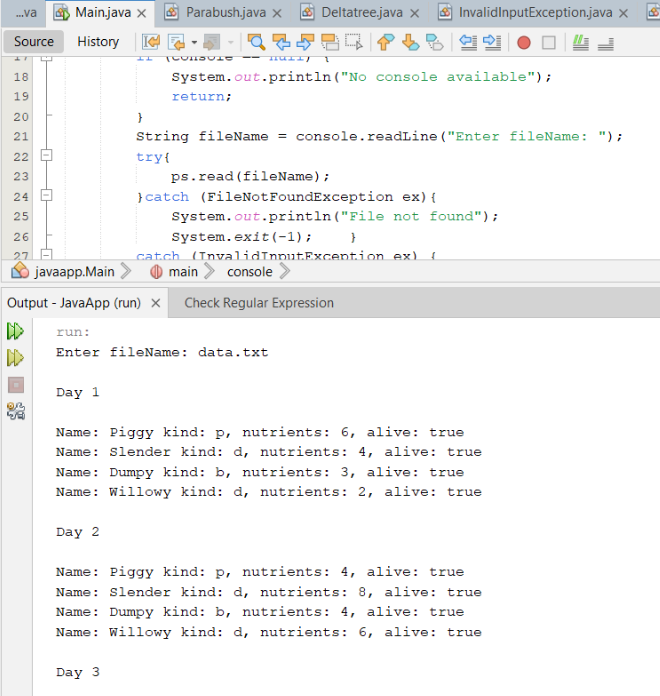
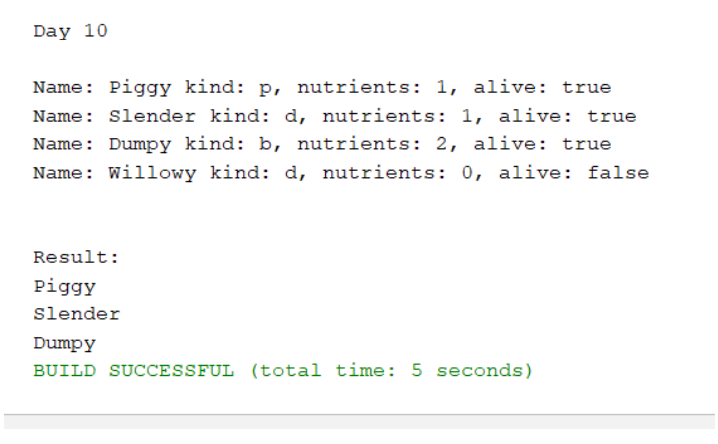

# Assignment description :

There is a planet, where different kind of plants are living. All the plants are using nutrients to live. If a plant runs out of its nutrients, it dies. Each day one radiation type can occur from the followings: alpha, delta, or no radiation. Radiations affect the plants differently based on their types. The reaction of a plant to a given radiation consists of the following: it changes its nutrient level, and affects the radiation of the next day. The radiation of the next day:
a. alpha, if the need for alpha radiation is 3 or more greater than for the delta radiation
b. delta, if the need for delta radiation is 3 or more greater than for the alpha radiation
c. no radiation, otherwise
There is no radiation on the first day...
Simulate the behaviors of the plants, and print out the radiation of the day and the properties of the plants on each day.
Properties of the plants: name (string), nutrients (integer), living (boolean). The types of the plants in the simulation: puffs, deltatree, parabush.
On a day of the the simulation the living plant first changes its nutrients, then if it is still alive, it can affect the radiation of the next day.

Read the data of the simulation from a text file. The first line contains the number (n) of the plants. The following n lines contain the information about the plants: name, type, initial nutrient level. Type is represented by one character: p - Puffs, d - Deltratree, b - Parabush. The last line of the file defines the number of the days you have to simulate.
The program should ask for the name of the file, and it has to print out the name of the survivors (we can assume that the file is existing and its format is valid).

# Analysis and Solution plan:
In a task we are given 3 types of plants Puffs, Parabush and Deltatree. For those I created a class Plant and inherited 3 types of plants from it. In a parent class I created several abstract classes which were overridden for children classes. For radiation affect plants I created interface Radiation from what 3 types of radiation were inherited : Alpha, Delta and NoRadiation. To calculate what kind of radiation will affect plant for the next day I created a method that calculate it in a Simulation class. Class Database will be used for reading data from a file and storing them.

# A class diagram:

1) isAlive abstract method, which we override the condition for each type of plants to check if it still alive or not.(different type of plant have different condition for nutrients to be alive). Return boolean.
2) Get_alpha_need is abstract method which we override to use it for deciding later what kind of radiation will affect plant for a next day.(using our table given in a task, because different type of plant have different condition). Return int.
3) Get_delta_need is abstract method which we override to use it for deciding later what kind of radiation will affect plant for a next day.(using our table given in a task , because different type of plant have different condition). Return int.
4) Affect method in interface is overridden then for all kind of radiation(alpha, delta, no radiation). It affect each animal using this kind of radiation based on a table values given in a tasks. Doesn’t return anything.
5) Read method reads the data from txt file, create a new instance of a plant and store it to a list of plants. In case of error it throws exception. Read from a file using scanner. Doesn’t return anything.
6) NextDayRadiation method compare nutrients needed for alpha and delta (based on a condition given in a task) to choose what kind of radiation will affect for a next day. This method returns object type of radiation.
7) Simulation method simulate n days of radiation for plants and print out the result of each day nutrients changes and if the plant still alive.

# Application:
Run the program and the program is asked for name of a file:

In case of file with no plants the output will be:

If the file contain elements then simulation will be started:

By the end of a simulation names of survived plants are printed.

## AS A USER I WANT TO simulate plants behavior
- **GIVEN**:a file containing 4 plants and 10 days that we need to simulate  
- **WHEN**: the simulation starts
- **THEN**: all 10 days of simulation are printed and survivors are printed out correctlly

## AS A USER I WANT TO simulate plants behavior
- **GIVEN**: a file containing 0 plants and 10 days that we need to simulate
- **WHEN**: the simulation starts
- **THEN**: “file doesn’t contain anything” printed
  
## AS A USER I WANT TO simulate plants behavior with all plants started with 0 nutrients
- **GIVEN**: a file containing 3 plants with 0 nutrients and 10 days that we need to simulate
- **WHEN**: the simulation starts 
- **THEN**: all 10 days of simulation are printed, no survivors left

## AS A USER I WANT TO simulate plants for 1 day only
- **GIVEN**: a file containing 4 plants and 1 day that we need to simulate
- **WHEN**: the simulation starts
- **THEN**: 1 day of simulation is printed, survivors printed

## AS A USER I WANT TO simulate effect of alpha radiation on Deltatree
- **GIVEN**: a file containing 1 plant strarting with 6 nutrients
- **WHEN**: the simulation starts
- **THEN**: the nutrients should be changed by the end of the simulation

## AS A USER I WANT TO simulate effect of delta radiation on Deltatree
- **GIVEN**: a file containing 1 plant strarting with 4 nutrients
- **WHEN**: the simulation starts 
- **THEN**: the nutrients should be changed by the end of the simulation

## AS A USER I WANT TO simulate 150 days of radiation effect
- **GIVEN**: a file containing 5 plants
- **WHEN**: the simulation starts 
- **THEN**: the 150 days of simulation are printed and survivors are printed

## AS A USER I WANT TO simulate only Puffs
- **GIVEN**: a file containing 5 Puffs
- **WHEN**: the simulation starts
- **THEN**: the simulation ends, nutrients change for all days are printed, all survivors are printed

## AS A USER I WANT TO simulate only Deltatree
- **GIVEN**: a file containing 3 Deltatree
- **WHEN**: the simulation starts 
- **THEN**: the simulation ends, nutrients change for all days are printed, all survivors are printed

## AS A USER I WANT TO simulate mixed types of plants
- **GIVEN**: a file containing Puffs, Deltatree, Parabush plants
- **WHEN**: the simulation starts 
- **THEN**: the simulation ends, nutrients change for all days are printed, all survivors are printed
  
## AS A USER I WANT TO simulate no radiation for several days
- **GIVEN**: a file containing several plants
- **WHEN**: the simulation starts 
- **THEN**: the simulation ends, nutrients change for all days are printed, all survivors are printed

  ## AS A USER I WANT TO simulate of death of one plant
- **GIVEN**: a file containing 4 plants
- **WHEN**: the simulation starts 
- **THEN**: the simulation ends, 1 plant is dead and 3 still alive
  
  ## AS A USER I WANT TO simulate of death of plants on the same days
- **GIVEN**: a file containing 4 plants
- **WHEN**: the simulation starts 
- **THEN**: the simulation ends all 4 plants are dead on the same day

## AS A USER I WANT TO simulate survival of Parabush
- **GIVEN**: a file containing Parabush with a big number of nutrients and 3 days to simulate
- **WHEN**: the simulation starts 
- **THEN**: the simulation ends and by the end of 3 days Parabush is still alive
  
 

